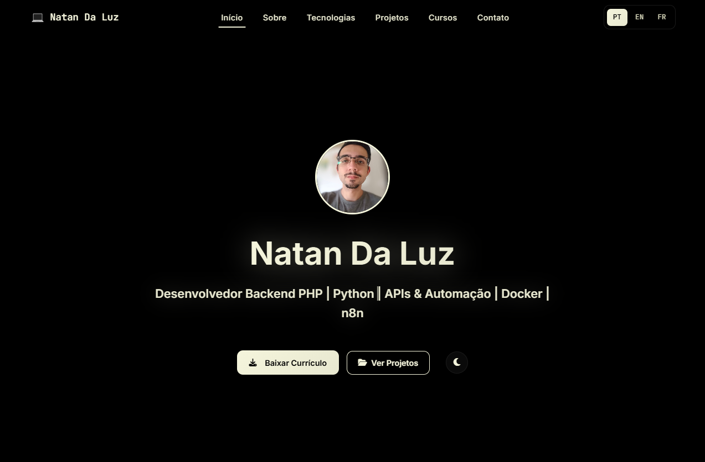

# Natan da Luz Portfolio – Frontend Developer

[]()
[]()
[]()
[]()
[](LICENSE)

---

## Project Purpose (read)
This project serves as a **professional showcase** for a frontend developer, enabling potential employers, clients, and collaborators to quickly understand technical skills, professional background, and completed projects.  
It provides a **centralized, visually appealing, and responsive platform** to present expertise in JavaScript, Python, Java, and modern web technologies.  
Additionally, it demonstrates **UI/UX design skills, accessibility awareness, and clean coding practices**, ensuring a strong first impression and effective communication of professional capabilities.





---

## Overview
Professional portfolio of **Natan da Luz**, a Frontend Developer specializing in **JavaScript, Python, Java**, and modern web technologies.  
The project was built with a focus on **clean design**, **responsiveness**, and an **optimized user experience**.

---

## Project Goal
To create a professional portfolio that clearly and effectively presents the developer’s **technical skills**, **projects**, and **experience**, while maintaining a **modern and minimalistic design**.

---

## Technologies Used

### Frontend
- **HTML5** – Semantic structure
- **CSS3** – Advanced styling with CSS variables and themes
- **JavaScript** – Interactive functionalities
- **Bootstrap 5** – CSS framework for responsiveness
- **AOS (Animate On Scroll)** – Smooth animations

### Development Tools
- **VS Code** – Main code editor
- **IntelliJ IDEA** – IDE for Java development
- **Git** – Version control
- **GitHub** – Repository hosting

---

## Implemented Themes
- **Dark Theme (Default)**: Black background with beige/cream text
- **Light Theme**: White background with dark text
- **CSS Variables System**: Facilitates maintenance and consistency

### Color Palette
```css
/* Dark Theme */
--primary-color: #f5f5dc; /* beige */
--background-color: #000000; /* black */
--text-primary: #f5f5dc; /* beige */

/* Light Theme */
--primary-color: #2d3748; /* dark gray */
--background-color: #f7fafc; /* white */
--text-primary: #2d3748; /* dark gray */


Project Structure

Main Sections

Hero Section – Initial presentation with photo and CV download button

About – Personal information, soft skills, and languages

Technologies – Technical stack organized by category

Projects – Portfolio of completed work

Certificates – Credentials and certifications


---

Strategic Improvements Implemented
1. Theme System

Repositioned toggle button in the hero section

Smooth light/dark theme transitions

User preference persistence via localStorage

---

2. Optimized Navigation

Menu items positioned for better usability

Subtle hover effects with underline indicators

Active navigation based on the current section

---

3. About Section – Soft Skills

Removed unnecessary icons

Clean layout with text only

Responsive grid adapting to content

---

4. Technologies Section

Frontend: Maintained original spacing (HTML5, CSS3, JavaScript, Bootstrap, Tailwind)

Backend: Reduced spacing between icons (Python, Java, SQL, APIs)

Tools: Added VS Code and IntelliJ IDEA

Removed excessive hover effects

---

5. Projects Section

Responsive cards with detailed information

Links to GitHub and live demos

Technology tags for each project

Overlay effects only on links

---

. Certificates Section

Removed "JavaScript from Zero to Advanced" certificate (no image available) obs: because before when I put it it looked bad, so I decided to leave only the 3 best certificates I have

---

7. Contact Section

Minimalistic design without backgrounds or boxes

Golden-colored icons (#f59e0b)

Direct links to Email, LinkedIn, and GitHub

No excessive hover effects

---

8. Performance Optimizations

Removed unnecessary animations

Smooth transitions only where needed

Clean, well-structured code

---

Features
Language System

Portuguese (PT) – Default language

English (EN) – Full translation

French (FR) – Full translation

Dynamic switching without reloading the page 

---

Responsiveness

Mobile First – Optimized for mobile devices

Tablet – Adaptive layout

Desktop – Full experience

---

Accessibility

Full keyboard navigation support

Semantic structure for screen readers

Proper contrast for guaranteed readability

---

📂 File Structure

Portfolioweb-main/
├── index.html              # Main page
├── style.css               # CSS styles
├── script.js               # JavaScript functionalities
├── translations.js         # Translation system
├── assets/
│   └── NatanDaLuzCvDev.pdf # Resume
├── img/                    # Images and icons
│   ├── foto portfolio.jpg
│   ├── *.svg               # Technology icons
│   ├── *.webp              # Project images
│   └── *.PNG               # Certificates
└── README.md               # Documentation

---

Quality Metrics
Performance

Fast loading – optimized images

Clean, organized code

SEO-optimized with meta tags and semantic structure

---

Usability

Intuitive navigation – clear and accessible menu

Well-organized information – clearly defined sections

Clear call-to-actions – contact and download buttons

---

Design

Professional look – consistent colors and typography

Responsive – works on all devices

Accessible – proper contrast and navigation support

Contact

Email: natandaluz01@gmail.com

LinkedIn: https://www.linkedin.com/in/natan-da-luz/

### THANKS!
