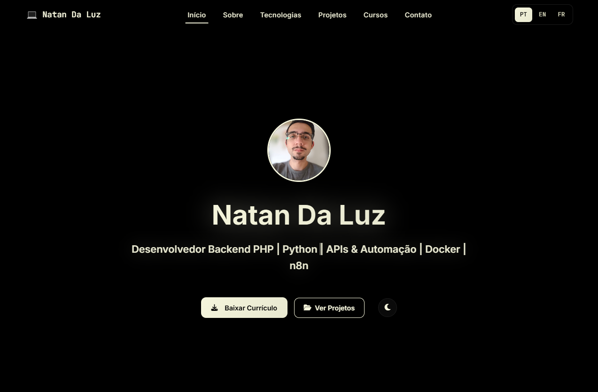

# Portfólio Web — Website Pessoal

Aplicação web estática desenvolvida para apresentação profissional, reunindo projetos, tecnologias e evolução como desenvolvedor backend, com suporte a múltiplos idiomas e personalização de interface.

---

## 🎯 Proposta de Valor

Centralizar a apresentação profissional em um único ambiente digital, permitindo comunicação clara das competências técnicas, projetos desenvolvidos e evolução como desenvolvedor.

**Benefícios principais:**

- Apresentação estruturada de projetos e habilidades
- Suporte multilíngue (PT/EN/FR)
- Interface responsiva e acessível
- Personalização de tema (claro/escuro)
- Experiência fluida para recrutadores e visitantes

---

## ⚙️ Funcionalidades

### Interface e UX

- Layout responsivo (desktop, tablet e mobile)
- Navegação simples e intuitiva
- Botão de voltar ao topo
- Animações com AOS (Animate On Scroll)

### Internacionalização

- Suporte a múltiplos idiomas (Português, Inglês e Francês)
- Sistema baseado em `data-translate`
- Gerenciamento centralizado via `translations.js`

### Personalização

- Alternância de tema claro/escuro
- Persistência de preferência com `localStorage`

### Conteúdo

- Seção de tecnologias (ênfase em backend: PHP, Python, SQL)
- Seção de projetos reais
- Apresentação da trajetória e evolução profissional

---

## 🏗️ Arquitetura / Estrutura

Separação clara entre estrutura, estilo e comportamento:

- **HTML** → estrutura e conteúdo
- **CSS** → estilização, responsividade e temas
- **JavaScript** → interatividade, idioma e controle de UI

**Estrutura do projeto:**

```bash
Portfolioweb/
├── index.html
├── style.css
├── script.js
├── translations.js
├── img/
└── README.md
```

---

## 🔐 Segurança

- Aplicação totalmente estática (sem backend)
- Nenhuma manipulação de dados sensíveis
- Uso controlado de scripts externos
- Boas práticas em links externos (`rel="noopener"`)

---

## 🧰 Stack Tecnológica

- HTML5
- CSS3
- JavaScript
- AOS (Animate On Scroll)

---

## 🚀 Instalação

### Pré-requisitos

- Navegador moderno (Chrome, Edge ou Firefox)

### Execução

Como é um projeto estático, basta abrir o arquivo `index.html`.

Opcionalmente, execute com servidor local:

```bash
python -m http.server 8080
```

Acesse:

http://localhost:8080

---

## 🧪 Testes Rápidos

Checklist funcional:

- Validar troca de idioma (PT/EN/FR)
- Testar alternância de tema (claro/escuro)
- Verificar responsividade (mobile/tablet/desktop)
- Navegar entre seções
- Validar animações (AOS)
- Testar links externos

---

## 📸 Screenshots

Preview da página principal:



---

## 👤 Autor

Natan Da Luz  
Desenvolvedor de Software

📧 natandaluz01@gmail.com  


🔗 https://www.linkedin.com/in/natan-da-luz-3156582a2/

