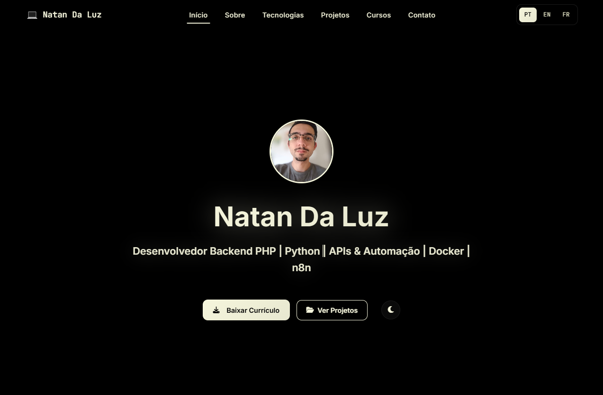

# Portfólio WEB — Natan Da Luz

Portfólio pessoal desenvolvido com React e Vite para apresentar meu perfil profissional, tecnologias, projetos e formas de contato.

## Tecnologias

O portfólio utiliza:

- React;
- Vite;
- JavaScript;
- HTML5;
- CSS3;
- Bootstrap, carregado externamente para estrutura responsiva e classes utilitárias;
- Font Awesome, carregado externamente para os ícones;
- Google Fonts, com as famílias Inter e JetBrains Mono.

## Funcionalidades

- interface componentizada em React;
- layout responsivo para desktop, tablet e dispositivos móveis;
- navegação responsiva com menu mobile;
- identificação da seção ativa e comportamento dinâmico da navbar durante a rolagem;
- navegação suave entre seções com compensação para a navbar fixa;
- tradução completa para Português, Inglês e Francês;
- persistência do idioma selecionado no `localStorage`;
- atualização do idioma do documento, título e meta description;
- alternância entre os temas claro e escuro, com preferência persistida;
- animações de entrada implementadas com `IntersectionObserver`;
- efeito de digitação no título do Hero;
- barra de progresso da página;
- botão para voltar ao topo;
- seções de apresentação, tecnologias, projetos e contato;
- cópia do endereço de e-mail antes da abertura do aplicativo de e-mail;
- suporte a `prefers-reduced-motion` para reduzir animações quando solicitado pelo sistema.

## Arquitetura

```text
src/
├── components/
├── contexts/
├── hooks/
├── i18n/
├── App.jsx
└── main.jsx
```

- `components/`: componentes visuais e seções da interface;
- `contexts/`: estados globais de idioma, tema e rolagem;
- `hooks/`: comportamentos reutilizáveis, como tradução, seção ativa, animações e digitação;
- `i18n/`: catálogo de traduções da aplicação;
- `App.jsx`: composição principal da interface;
- `main.jsx`: inicialização do React e configuração dos providers globais.

## Estrutura principal da aplicação

```text
main.jsx
└── Providers de idioma, tema e rolagem
    └── App.jsx
        ├── ScrollProgress
        ├── Header
        ├── Hero
        ├── About
        ├── Technologies
        ├── Projects
        ├── Contact
        ├── Footer
        └── BackToTop
```

## Projetos apresentados

- **Meu Saldo Certo:** sistema financeiro desenvolvido em Laravel para gerenciar receitas, despesas, categorias e saldo por usuário autenticado;
- **PetSystem:** sistema de gestão para petshops, com organização de atendimentos, clientes, pets e serviços;
- **CorteAzul:** website institucional responsivo criado para fortalecer a presença digital e facilitar o contato com clientes.

## Prévia



## Como executar localmente

É necessário ter Node.js e npm instalados.

```bash
git clone https://github.com/NatanLuz/Portfolioweb.git
cd Portfolioweb
npm install
npm run dev
```

O Vite exibirá no terminal o endereço local da aplicação.

## Scripts disponíveis

- `npm run dev`: inicia o servidor de desenvolvimento do Vite;
- `npm run build`: gera o build otimizado para produção;
- `npm run lint`: executa a análise estática do código com ESLint;
- `npm run preview`: inicia uma prévia local do build de produção.

## Build de produção

```bash
npm run build
```

O comando gera os arquivos otimizados na pasta `dist/`. Esse diretório é um artefato de build e não é versionado.

## Internacionalização

A aplicação oferece Português, Inglês e Francês. O catálogo React está em `src/i18n/translations.js`, e o `LanguageContext` controla o idioma atual, o fallback das traduções e a persistência da preferência no `localStorage`.

## Tema

Os temas claro e escuro são controlados pela infraestrutura de contexto do React. A escolha do usuário é aplicada por meio do atributo `data-theme` e armazenada no `localStorage`.

## Deploy

O deploy de produção é realizado pela Vercel a partir do repositório no GitHub.

Aplicação: [portfolionatan.vercel.app](https://portfolionatan.vercel.app/)

## Autor

**Natan Da Luz**

- [GitHub](https://github.com/NatanLuz)
- [LinkedIn](https://www.linkedin.com/in/natandaluz/)
- [Portfólio](https://portfolionatan.vercel.app/)
