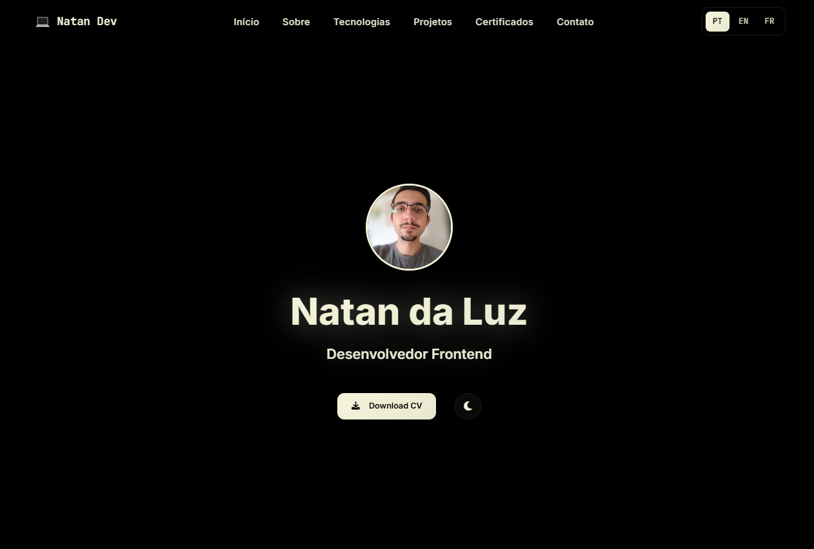

<div align="center">
   

# Portfólio — Natan Da Luz

Desenvolvedor de Software (Fullstack)

</div>

---

## Visão Geral

Site estático e profissional para apresentar projetos, competências e experiência em desenvolvimento de software. A aplicação é responsiva, multilíngue (PT/EN/FR), com alternância de tema claro/escuro e microinterações agradáveis.

---

## Destaques de Projetos

- **Workshift Manager — Sistema de Escalas de Trabalho**: Aplicação desktop (Python/Tkinter) para geração de escalas semanais/mensais, regras de negócio (folgas, turnos, validações), persistência em SQLite e exportação para Excel (Pandas/OpenPyXL).
- **Amazon Scraper — Aplicação Web Fullstack**: JavaScript (Node.js/Express) para busca e comparação de produtos da Amazon usando Fetch APIs e JSDOM. Interface responsiva com HTML5, CSS3 e Tailwind CSS.
- **Sistema de PetShop**: Plataforma fullstack com dashboard, CRUD, agendamentos e segurança reforçada.
- **CorteAzulTea**: Website profissional com foco em atendimento humanizado.

Imagens dos projetos estão em `img/` e são carregadas com `loading="lazy"`.

---

## Funcionalidades

- Layout responsivo (mobile/desktop) com animações AOS
- Suporte a idiomas (PT/EN/FR) usando `data-translate` e `data-translate-attr`
- Alternância de tema (`dark`/`light`) com persistência em `localStorage`
- Barra de progresso de scroll e botão “Voltar ao topo”
- Links de contato e redes profissionais

---

## Tecnologias

- **Frontend:** HTML5, CSS3, JavaScript, Tailwind CSS
- **Backend:** PHP, Laravel, MySQL/SQL
- **Desktop:** Python, Tkinter, SQLite, Pandas, OpenPyXL
- **Ferramentas:** Git, GitHub, VS Code, AOS, Font Awesome

---

## Estrutura

```
Portfolioweb/
├── index.html        # Página principal e seções (home/sobre/tecnologias/projetos/contato)
├── style.css         # Tema (variáveis CSS), responsividade e componentes
├── script.js         # Interações: idioma, tema, scroll, animações e lazy-loading
├── translations.js   # Chaves PT/EN/FR para textos e atributos
├── assets/           # Currículo e documentos
├── img/              # Imagens e ícones dos projetos
└── README.md         # Documentação
```

---

## Uso e Execução

```bash
git clone https://github.com/NatanLuz/Portfolioweb.git
cd Portfolioweb
```

Abra `index.html` diretamente no navegador.

### Idiomas

- Botões `PT | EN | FR` no cabeçalho alternam o idioma.
- Textos usam `data-translate`; atributos usam `data-translate-attr`.

### Tema

- Botão de lua/sol alterna entre `dark` e `light` (salvo em `localStorage`).

---

## Convenções do Projeto

- Respeitar variáveis de tema (`:root` e `[data-theme="light"]`); evitar cores fixas.
- Manter paridade de traduções em PT/EN/FR ao adicionar novos textos.
- Seguir o padrão de cards `.project-card` e grade `.tech-grid` para novos itens.
- Usar `rel="noopener"` em links externos e `aria-label` com `data-translate-attr` quando aplicável.

---

## Contato

- **Email:** natandaluz01@gmail.com
- **LinkedIn:** https://www.linkedin.com/in/natan-da-luz-3156582a2/
- **GitHub:** https://github.com/NatanLuz

---

## Licença

Projeto de portfólio pessoal. Entre em contato para solicitações de uso ou colaboração.
